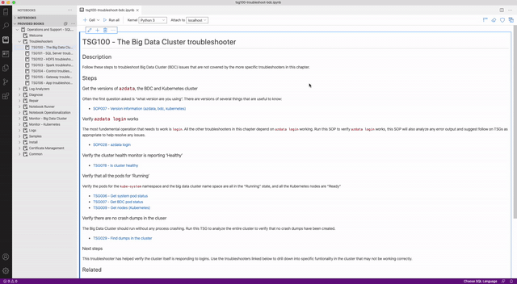

# Azure Data Bot

Extension for Azure Data Bot within Azure Data Studio

## Features

This project involves 3 major components: 

- Azure QnA Maker Cognitive Service 

- Azure Bot Service 

- AzureDataBot-Extension

### Launch the Azure Data Bot using:

Open the Command Palette (Ctrl+Shift+P) -> Type `Launch Azure Data Bot`

This will open the Azure Data Bot and you can begin the support by saying "Hello".

## Demo

## Requirements

1. Clone the Repository using `git clone`. 
2. Navigate to the base directory of the extension, and run `vsce package`. I had to add in a couple of extra lines to stop the vsce tool from complaining:

## Known Issues

- Duplicate Welcome Message (fixed soon!)

